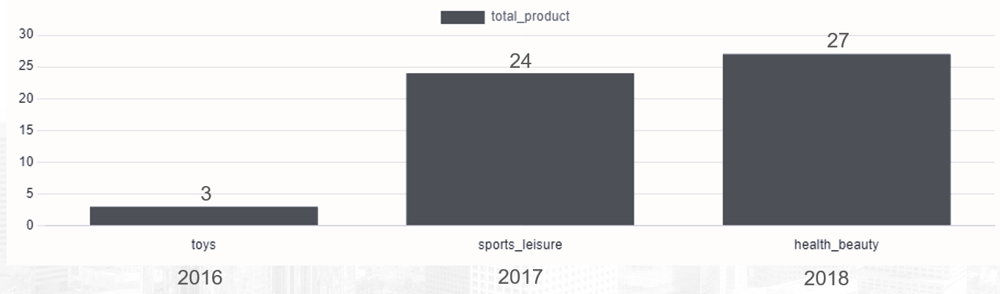

# Analyzing E-Commerce Business Performance with SQL

- Tool and Visualization: PostgreSQL version 15.3.
- Dataset: Sourced from [Rakamin Academy](https://github.com/kevinusmayadhyw/Analyzing-eCommerce-Business-Performance-with-SQL/tree/main/Dataset).

## Stage 0: Business Understanding
Within a company, the measurement of business performance plays a crucial role in tracking, monitoring, and evaluating the success or failure of diverse business processes. Consequently, this project aims to analyze the business performance of an eCommerce company, considering several key metrics such as customer growth, product quality, and payment types.

To conduct an analysis of the business performance as previously outlined, this project is organized into several stages, which include:
- Stage 1: Data Preparation
- Stage 2: Analysis of Annual Customer Activity Growth
- Stage 3: Analysis of Annual Product Category Quality
- Stage 4: Analysis of Annual Payment Type Usage

## Stage 1: Data Preparation

Before commencing the analysis, the initial step is to prepare the raw data and transform it into structured data that is ready for utilization.

In this stage, the following actions are performed:

1. Creation of a new database in pgAdmin named "miniProject1_AnalyzingECommerceBusinessPerformanceWithSQL."
2. Create a table and copy the dataset from the CSV file starting from the customers_dataset, geolocations_dataset, orders_items_dataset, payments_dataset, reviews_dataset, orders_dataset, products_dataset, sellers_dataset tables.
3. Rectification of the geolocations_dataset by adding a new geolocation_zip_code_prefix derived from the existing zip_code_prefix in customers_dataset and sellers_dataset. then making the geolocation_zip_code_prefix unique so that it can be used as a Primary Key.
4. Integration of foreign keys into the tables:
   - reviews_dataset in the order_id column linked to the orders_dataset table.
   - payments_dataset in the order_id column linked to the orders_dataset table.
   - order_items_dataset in the order_id column linked to the orders_dataset table.
   - order_items_dataset in the product_id column linked to the products_dataset table.
   - order_items_dataset in the seller_id column linked to the sellers_dataset table.
   - orders_dataset in the customer_id column linked to the customers_dataset table.

Code: [1_Data_Preparation](https://github.com/kevinusmayadhyw/Analyzing-eCommerce-Business-Performance-with-SQL/tree/main/1_Data_Preparation).

Result:

## Stage 2: Analysis of Annual Customer Activity Growth
In this stage, the analysis focuses on metrics related to customer activity, a crucial aspect in measuring eCommerce business performance. The following metrics will be explored:

1. Displaying the average number of monthly active customers for each year.

In 2016, the average Monthly Active Users (MAU) were the lowest compared to the subsequent years. This could be attributed to the fact that new orders occurred only in 3 months during that year, so maybe marketing efforts had not yet reached a wide audience.

2. Displaying the count of customers who made repeat orders (purchases more than once) and new order in each year.

Annually, the number of new customers consistently exceeds the number of repeat orders. The assumption here is that this pattern might arise from either a low level of customer satisfaction or the presence of benefits predominantly offered to new customers, potentially leading to a lack of loyalty and discontinued use of the service by existing customers.

3. Displaying the average number of orders placed by customers for each year.

Each year, the average customer only orders once, which increased from 2016 to 2017. Meanwhile, in 2018 there was a decrease.

4. Consolidating the successfully displayed metrics into a unified table view.

In the analysis, it is observed that the year 2016 has the lowest values across all aspects. On the other hand, the year 2018 stands out with the highest values in average monthly active users (avg_mau), total new customers, and total repeat orders. Additionally, the year 2017 achieves the highest value in average orders (avg_order).

Code : [2_Annual_Customer_Activity_Growth_Analysis](https://github.com/kevinusmayadhyw/Analyzing-eCommerce-Business-Performance-with-SQL/tree/main/2_Annual_Customer_Activity_Growth_Analysis).

## Stage 3: Analysis of Annual Product Category Quality
The success of an eCommerce business is inherently tied to the products it offers. Analyzing the quality of products in eCommerce can offer insights for making decisions to enhance business development. This stage will involve analyzing the performance of each existing product category and exploring its correlation with company revenue. In this stage, the analysis will involve the following steps:
1. Table containing information on the company's total income/revenue for each year.

The total income has shown a consistent increase from year to year. Despite the lower Monthly Active Users (MAU) count in 2018 compared to 2017, the total revenue for 2018 exceeded that of 2017. This increase may be attributed to a growth in the number of customers during that period.
2. Visualization of information on the total number of canceled orders for each year.

3. Visualization of the names of product categories that generate the highest total revenue for each year.
4. Visualization of the names of product categories with the highest number of canceled orders for each year.

5. Combine the information that has been obtained into one table display

still on progress...